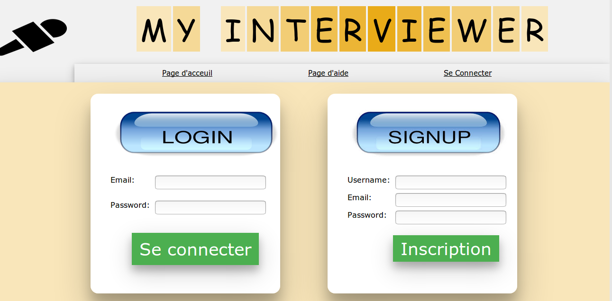
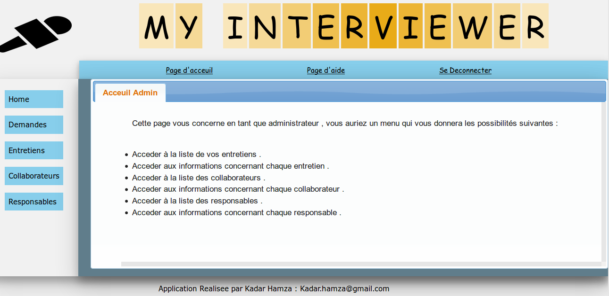
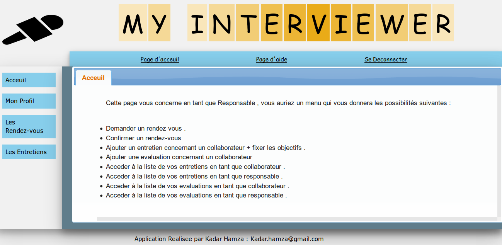
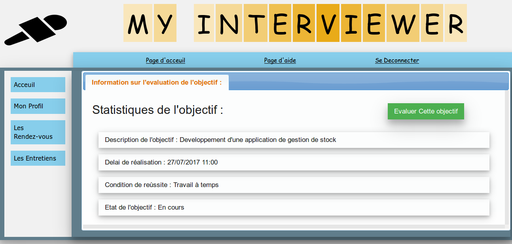

# THE Interviewer 

> ## (Service Entretien Evaluation )

ServiceEE - Interviewer : Application de gestion des entretiens annuels des collaborateurs dans une société de service en ingénierie informatique avec JEE

# Pourquoi Cette Application 

- Informatiser le processus des entretiens annuels .
- Informatiser le processus des evaluations des entretiens annuels .
- Gestion des rendez-vous entre les membres .

# Comment l'utiliser

- Installer Java ( JRE / JDK  1.8 )
- Importer le projet sous Maven .
- Installer les dependences necessaires à l'aide de Maven Install .
- Deployer le projet sur le serveur d'application Tomcat 8.5 .
- Definir les ports .
- Lancer l'application.

# Quelque Screens de l'application :

- Page Login + Inscription

- Home Admin 

- Home Responsable

- Page d'evaluation 

Kadar Hamza / kadar.hamza@gmail.com

Distributed under the KadH license. See ``LICENSE`` for more information.
